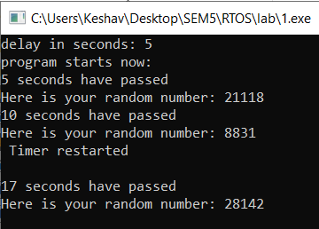
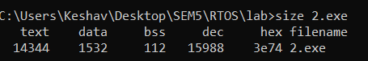
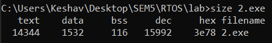
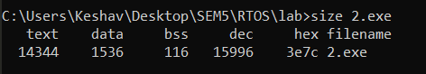

# RTOS-V-sem
# Keshav Garg | IoT Sem V | 35 | 500069767
This repository contains some codes that are done during study period of RTOS.

# delay.c
This a C program that allows the user to  define the time delay for an activity/function happening in the program.
To demonstrate the working random numbers are being printed at ergular intervals of time (provided by the user) and if user presses any key other than ESC the delay function get interuppted and starts again.

# memorymap.c

This file depicts the consumption of memory due to various variables and functionalities proposed in the program.

compile and run the various code segments provided in the file separately using following commands:

compile: gcc memorymap.c -o memorymap
run:     size memorymap

